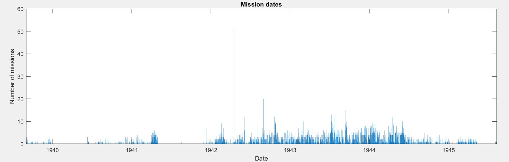
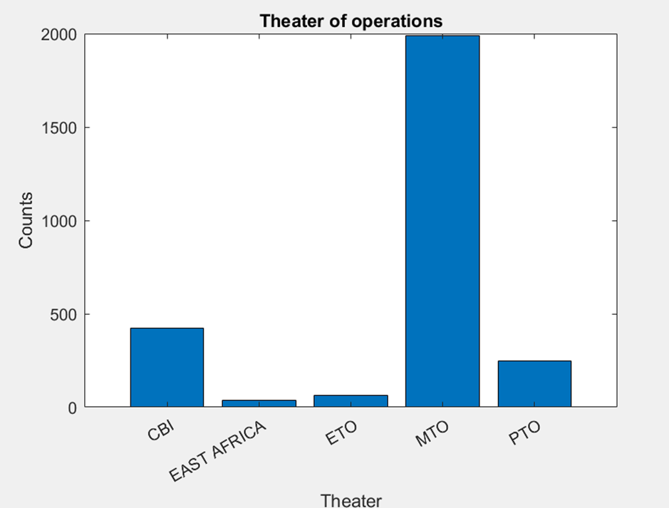
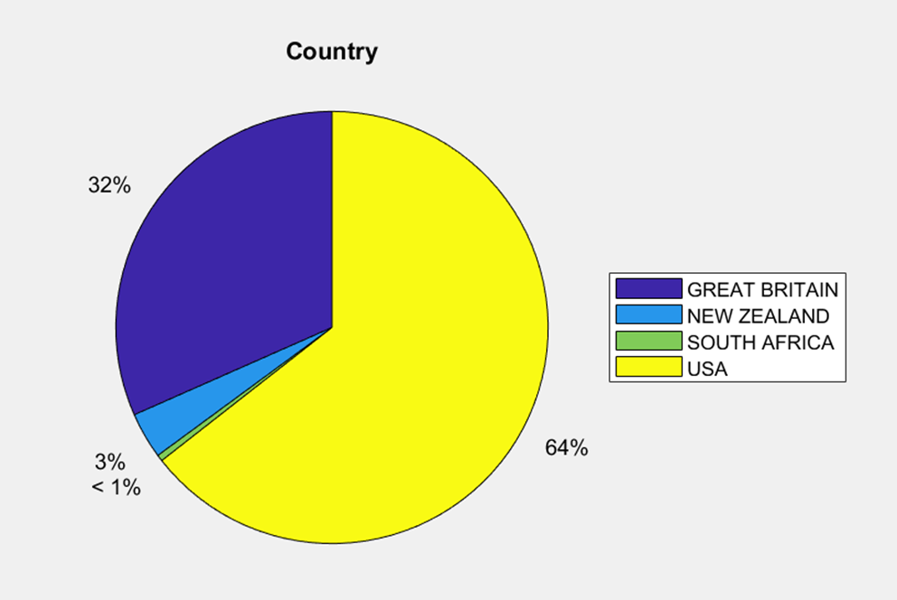
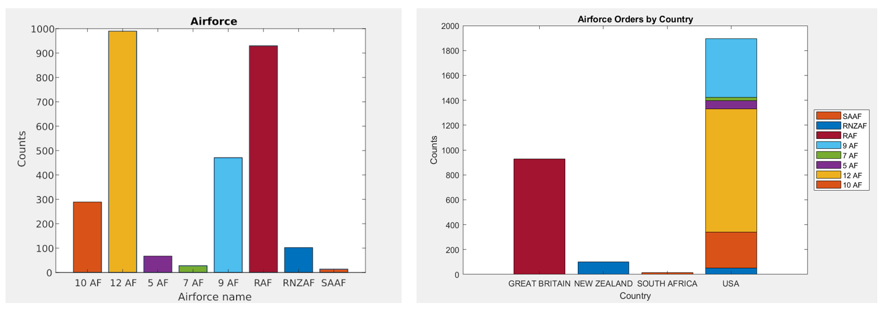
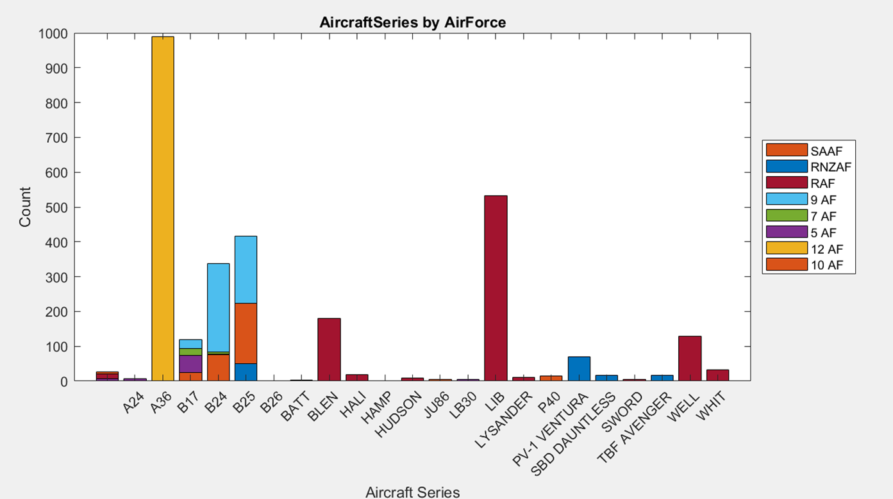
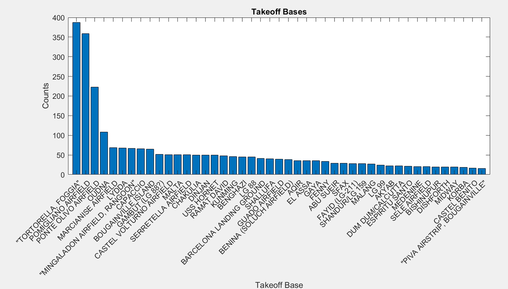
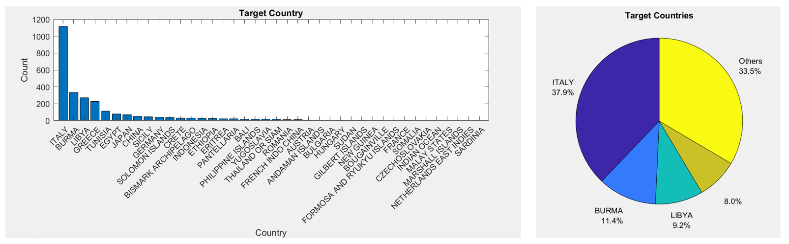
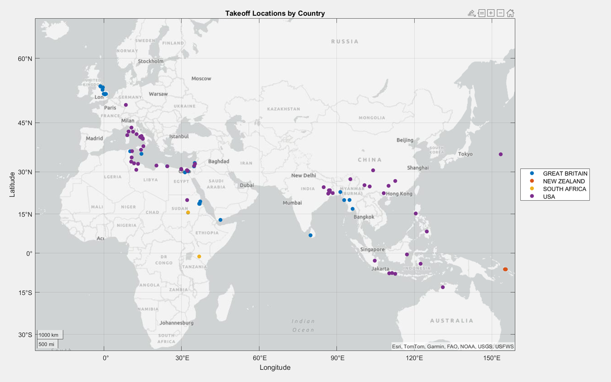
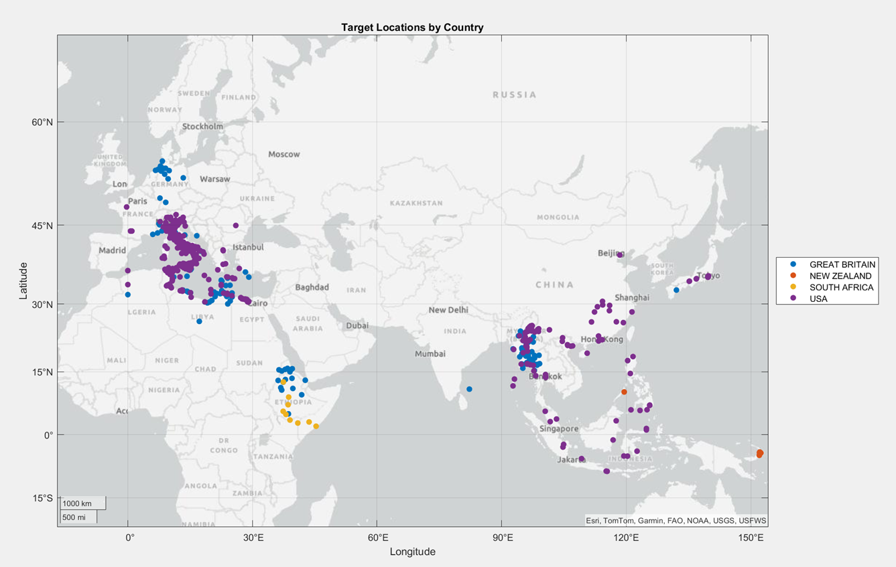

# Visualisation of Aerial Bombing Operations in World War II

Dataset taken from: https://www.kaggle.com/datasets/usaf/world-war-ii

Used attributes:
* Mission ID
* Mission date
* Theater of Operations
* Country
* Air Force
* Aircraft Series
* Takeoff base
* TakeoffLatitude
* TakeoffLongitude
* TargetCountry 
* Target Latitude
* Target Longitude

